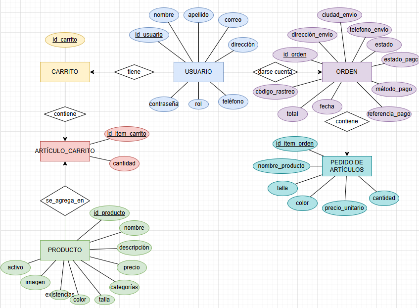
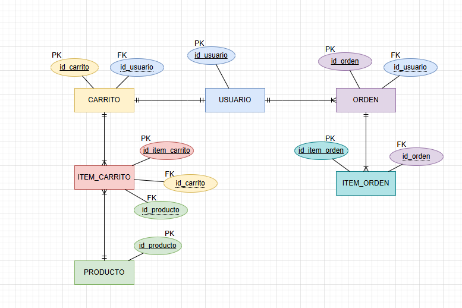
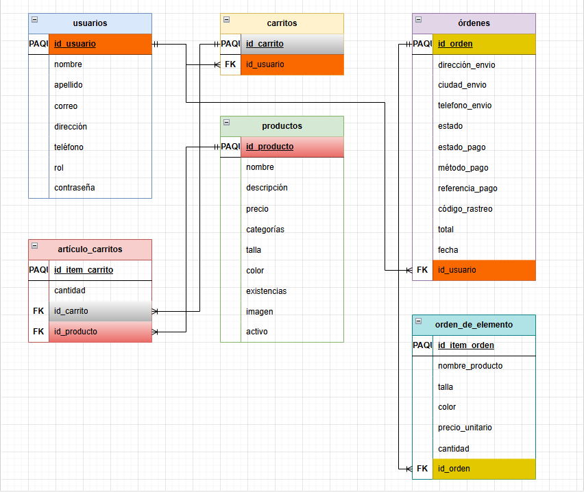

# Diagrama entidad-relación — Worven

# Tablas — Worven

Ajustado al MVP: catálogo filtra solo por categoría (sin variantes de stock por talla/color), y con la integración de pagos vía Wompi (modo sandbox).

## Entidades

### usuarios
| Campo |       Tipo |      Nota |
|---    |---         |---        |
| id_usuario |  PK   | |
| nombre |      texto | |
| apellido |    texto | |
| correo |      texto |     único |
| password |    texto |     hasheado |
| rol |         texto |     cliente / admin |
| direccion |   texto | |
| telefono |    texto | |

### productos
| Campo |       Tipo |      Nota |
|---|---|---|
| id_producto | PK | |
| nombre |      texto | |
| descripcion | texto | |
| precio |      decimal | |
| categoria |   texto |     hombre / mujer / niños |
| talla |       texto | |
| color |       texto | |
| stock |       entero | |
| imagen |      texto (url) | |
| activo |      booleano |  para desactivar sin eliminar |

### carritos
| Campo |       Tipo |      Nota |
|---|---|---|   
| id_carrito |  PK | |
| id_usuario |  FK |        relación 1 a 1 con usuarios |

### item_carritos
| Campo |        Tipo |      Nota |
|---|---|---|
| id_item_carrito | PK | |
| id_carrito |      FK | |
| id_producto |     FK | |
| cantidad |        entero | |

### ordenes
| Campo |            Tipo |     Nota |
|---|---|---|
| id_orden |         PK | |
| id_usuario |       FK | |
| direccion_envio |  texto | |
| ciudad_envio |     texto | |
| telefono_envio |   texto | |
| estado |           texto |   Pendiente / Enviado / Entregado / Cancelado — solo del envío |
| estado_pago |      texto |    Pendiente / Aprobado / Rechazado |
| metodo_pago |      texto |    ej: tarjeta, PSE |
| referencia_pago |  texto |    id de transacción que devuelve Wompi |
| codigo_rastreo |   texto |    lo asigna la empresa de envío |
| total | decimal | |
| fecha | fecha | |

### item_ordenes
| Campo |           Tipo |      Nota |
|---|---|---|
| id_item_orden |   PK | |
| id_orden |        FK | |
| nombre_producto | texto |     congelado al momento de la compra |
| talla |           texto |     congelado |
| color |           texto |     congelado |
| precio_unitario | decimal |   congelado |
| cantidad |        entero | |

## Relaciones

| Relación | Cardinalidad | FK |
|---|---|---|
| usuarios — carritos | 1 a 1 | carritos.id_usuario |
| usuarios — ordenes | 1 a muchos | ordenes.id_usuario |
| carritos — item_carritos | 1 a muchos | item_carritos.id_carrito |
| productos — item_carritos | 1 a muchos | item_carritos.id_producto |
| ordenes — item_ordenes | 1 a muchos | item_ordenes.id_orden |

## Decisiones de diseño registradas

- **No existe tabla de variantes de producto** (talla/color/stock por combinación) porque el MVP solo filtra por categoría — decisión validada con el equipo.
- **item_ordenes no tiene FK a productos** — los datos se copian ("congelan") al momento de la compra, para que cambios futuros en el producto (precio, desactivación) no afecten órdenes ya realizadas.
- **estado y estado_pago están separados** — el envío y el pago tienen ciclos de vida independientes desde que se integró Wompi.